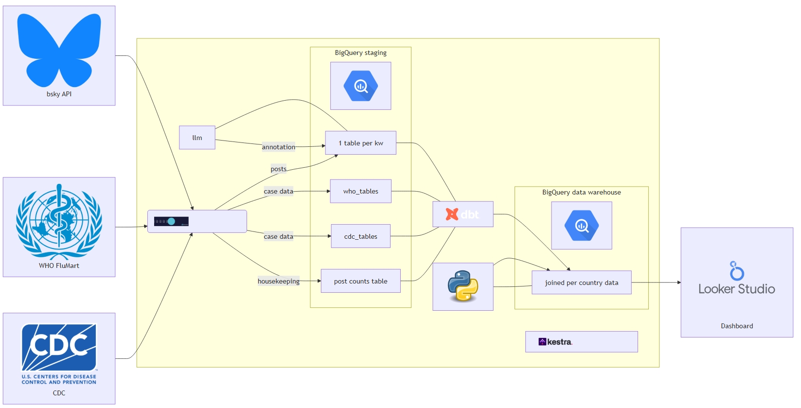
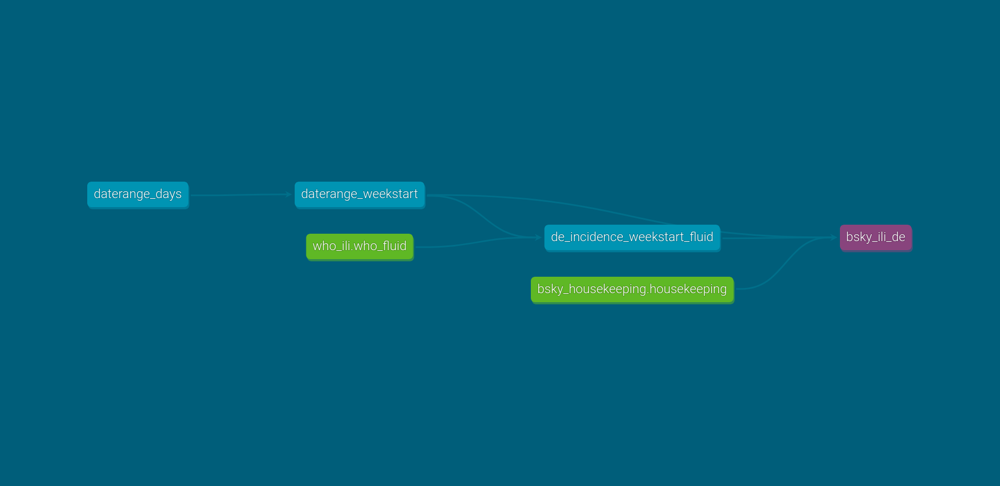

# `bluesky` social network analysis pipeline


Social media platforms have increasingly become valuable sources of
real-time information, reflecting public sentiment and behavior. This
project explores the potential of Bluesky, a relatively new social media
platform, for digital disease detection (DDD), specifically focusing on
influenza-like illness (ILI). By building an end-to-end data pipeline to
collect, process, and analyze Bluesky data in conjunction with
traditional epidemiological data sources from organizations like the WHO
and CDC, this project aims to assess the feasibility and effectiveness
of using Bluesky as an early warning system for disease outbreaks.

This is combined project for the 2025 Data Engineering Zoomcamp and my
course in Digital Epidemiology at Hasselt University.

The idea is to extract an epidemiological signal from social media posts
by counting posts matching queries related to ILI and correlate them
with public health surveillance data. Similar studies have been
performed using data from `twitter` who yielded promising results. For
obvious reasons, this kind of study is not feasible anymore and
`blueksy` is a potential alternative.

# Pipeline schema



# Tools

# Data Sources

- **Bluesky API**: This provides real-time access to posts and user data
  on the Bluesky platform.

- **WHO Data**: Data from the World Health Organization (WHO) serves as
  a crucial epidemiological reference, offering reliable statistics on
  influenza and other diseases, but there are delays in publication.

- **CDC Data**: Similar to the WHO, the Centers for Disease Control and
  Prevention (CDC) provides valuable data on disease prevalence and
  trends in the United States, but the dataset granularity is weekly. Up
  to December 2024 the data from the CDC were also incorporated into the
  WHO data but the data transmission to the WHO was stopped by the Trump
  administration.

# Data ingestion

The data extraction and ingestion to the BigQuery staging area (data
lake if you will) uses out-of-the-box functionality of `dlt` especially
denormalization of the `json` data for `bluesky` posts.

Each pipeline is instantiated using the
`dlt init <source> <destination>`, which creates the `.dlt/` directory
containing the necessary configuration files.

Credentials necessary to run the pipeline are stored in
`.dlt/secrets.toml` which are used for testing and locally initiated
runs of the pipeline.

In production, credentials are read from environment variables, see the
paragraph on [workflow
orchestration](#secrets-and-credentials-handling).

## Bluesky API

Two `dlt` pipelines were built using the [`bluesky`
API](http://public.api.bsky.app/).

### `bluesky` posts

``` bash
Usage: bsky_post_pipeline.py QUERY START_DATE <flags>
  optional flags:        --end_date | --out_file | --n_jobs | --verbose
```

This pipeline retrieves posts matching a given search query on a given
date or during a specified time window. It runs in parallel using at
max. 50 connections/threads. The retrieved posts are transferred to
BigQuery by `dlt`, each query has its own table.

### `bluesky` post counts

``` bash
Usage: bsky_housekeeping_pipeline.py QUERY START_DATE <flags>
  optional flags:        --end_date | --out_file | --n_jobs | --verbose
```

This pipeline is very similar to the `bsky_posts` pipeline. It is named
`housekeeping` as it retrieves only aggregated post counts per query per
date which serves as an indicator for overall user activity on
`bluesky`.

## WHO Data

``` bash
Usage: who_ili_pipeline.py "{fluid | flunet}" <flags>
  optional flags:        --verbose
```

Case data from the WHO are available in two datasets: `FluID` and
`FluNet` which are made available in `.csv` files. `pandas` is used to
load these files and `dlt` transfers them to a table in BigQuery.

## CDC Data, RKI Data

Similar pipelines are implemented for data from the Centers for Disease
Control and Prevention (CDC) and the Robert-Koch-Institute (RKI), the
public health agencies of the USA and Germany, respectively. These
pipelines are not used in the current project but might be in the
future.

# Data Transformation

Data transformation from the BigQuery staging area to the BigQuery data
warehouse is accomplished using `dbt`. There is some complexity in
aligning the time series of post counts from `bluesky` (daily data) to
the public health data which is available aggregated by week.

The figure shows as an example of combining WHO surveillance data with
`bluesky` post counts in German.



# Time Series forecasting

# CI/CD

# Workflow automation with `kestra`

The pipeline is orchestrated using `kestra`. Basically, there is one
flow defined for each extraction pipeline, building all the tables using
`dbt` and fitting the machine learning models. (see
[flows](./orchestration/kestra/flows/)).

All flows are chained together in a [main
flow](./orchestration/kestra/flows/bsky_main_triggered.yml) which is
triggered each night to ingest and process the data of the preceeding
day.

## Secrets and credentials handling

In the open-source version of `kestra`, secrets are handled via
environement variables that need to be `base64` encoded, prefixed with
`SECRET_` and passed to the the docker container on startup. I created a
python commandline tool that abstracts some of the complexity :
[`kestra_secret_encoder`](https://github.com/kantundpeterpan/kestra_secret_encoder).

### `dlt`

When `dlt` does not find a `secrets.toml` file, it looks for credentials
in using specifically named environment variables. For BigQuery:

<div class="code-with-filename">

**./orchestration/kestra/flows/bsky_housekeeping.yml**

``` yaml
env:      
  DESTINATION__BIGQUERY__CREDENTIALS__PROJECT_ID: "{{ secret('BIGQUERY_PROJECT_ID') }}"
  DESTINATION__BIGQUERY__CREDENTIALS__PRIVATE_KEY: "{{ secret('BIGQUERY_PRIVATE_KEY') }}"
  DESTINATION__BIGQUERY__CREDENTIALS__CLIENT_EMAIL: "{{ secret('BIGQUERY_CLIENT_EMAIL') }}"
```

</div>

(taken from
[./orchestration/kestra/flows/bsky_housekeeping.yml](./orchestration/kestra/flows/bsky_housekeeping.yml))

### `dbt`

For the production runs of `dbt` a special
[`docker_config/profiles.yml`](./dbt/digepi_bsky/docker_config/profiles.yml)
is used with

``` bash
dbt build --profiles-dir ./docker_config
```

during the runs.

It reads the credentials from environment variables:

<div class="code-with-filename">

**dbt/digepi_bskydocker_config/profiles.yaml**

``` yaml
keyfile_json:
        type: service_account
        project_id: digepizcde
        private_key: "{{ env_var('DBT_BIGQUERY_PRIVATE_KEY') }}"
        client_email: "{{ env_var('DBT_BIGQUERY_CLIENT_EMAIL') }}"
        private_key_id: "{{ env_var('DBT_BIGQUERY_PRIVATE_KEY_ID') }}"
        client_email: "{{ env_var('DBT_BIGQUERY_CLIENT_EMAIL') }}"
```

</div>

## Flow organizations
